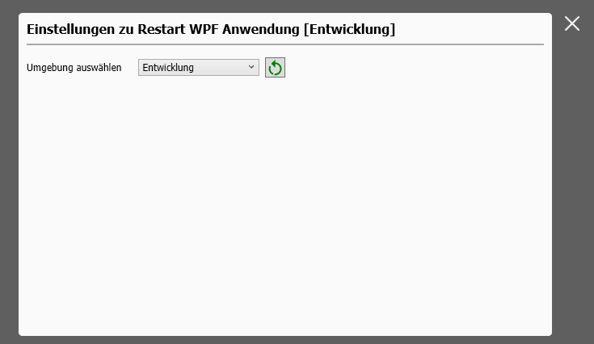

# WPF Restart Application


Aufgabe des Beispiel ist es, eine WPF Anwendung zu erstellen, die sich selbst neu starten kann. Dies ist besonders nützlich, wenn die Anwendung aktualisiert werden muss oder wenn bestimmte Einstellungen geändert wurden, die einen Neustart erfordern.

In dem Beispiel kann zwischen verschiedenen Umgebungen "Test, Entwicklung Produktion" gewählt werden. Diese werden in einer Settingsdatei gespeichert und bei Neustart ausgewertet.

Kernstück ist die Methode `RestartAsync`, die den Neustart der Anwendung durchführt. Sie nimmt optional Argumente entgegen, die beim Neustart übergeben werden können.
```csharp
public static async Task RestartAsync(string args = "Test")
{
    string exePath = Environment.ProcessPath;

    IsRestart = true;

    await Task.Delay(300);

    Process.Start(new ProcessStartInfo(exePath)
    {
        Arguments = $"--restarted#{args}",
        UseShellExecute = true
    });

    Application.Current.Shutdown();
}
```
Umgebung auswählen, beim Neustart wird die Auswahl in der Settingsdatei gespeichert und beim Neustart ausgewertet.\


Beim Start der Anwendung wird zuerst die Methode `OnStartup(StartupEventArgs e)` überschrieben, um die übergebenen Argumente auszuwerten und die Umgebung entsprechend zu setzen.
```csharp
if (e.Args != null && e.Args.Length > 0)
{
    if (e.Args[0].Contains("--restarted#"))
    {
        Settings.Umgebung = "Neustart mit Argument: " + e.Args
            .FirstOrDefault(arg => arg.StartsWith("--restarted#", StringComparison.CurrentCultureIgnoreCase))?
            .Split('#').LastOrDefault();
    }
}
```

Das Speichern der Einstellungen in die Settingsdatei erfolgt in der Methode `OnExit(ExitEventArgs e)`.
```csharp
protected override void OnExit(ExitEventArgs e)
{
    base.OnExit(e);

    Settings.LetzterZugriff = DateTime.Now;

    using (ApplicationSettings settings = new ApplicationSettings())
    {
        if (settings.IsExitSettings() == true)
        {
            settings.Load();
            settings.SetSetting(Settings);
            settings.Save();
        }
    }
}
```

# Versionshistorie

- Migration auf NET 10
